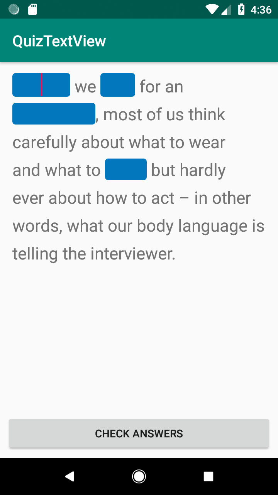

# QuizView
A simple ViewGroup extends FrameLayout to draw multiple EditText's over TextView, written in Kotlin.

# Sample App
Sample app is quiz-like text string with 4 empty spots.



# What can it do
- Setup where to draw EditText's like integer pairs (startOffset, endOffset)
```kotlin
    ArrayList<QuizSpot>().apply {
            add(QuizSpot(0, 6))
            add(QuizSpot(10, 14))
            add(QuizSpot(22, 33))
            add(QuizSpot(93, 98))
    }
```
- Setup onFocusChangeListener for EditText's. You can, for example, show hint for each spot when it is active.
```kotlin
quizView.spotFocusChangeListener = View.OnFocusChangeListener { v, hasFocus ->
                // show hint or log or whatever
}
```
- Supports accesibility in navigation: you can use `next` keyboard action or `Tab` on hardware keyboard. You can setup `check` View (here you may want to check if answer are correct) and it will become active during `tab` navigation after last EditText and `next` action will return focus to first EditText.
```kotlin
quizView.viewCheck = btnAnswers
```
